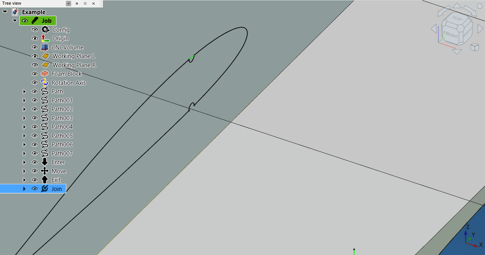

# FoamCut Workbench


A FreeCAD External Workbench for creating Gcode for 4 and 5 axis CNC foam cutting machine.

Originally it based on set of macros written by Andrei Bezborodov (HardRock) - member of FreeCad community. His idea was build 5 axis foam cutter and use FreeCad as a platform to produce output for this machine. Since he has no time to continue development further I decided to step in. Hopefully our effort will be appreciated. 

So far there are many limitation but I'm working on fixes.
If you want to contribute to this project - you highly welcome!
Enjoy!

## Installation

### Automatic Installation via Addon Manager (Recommended)

- Open Tools > Addon Manager

- Search for FoamCut and click install.

<details><summary>Expand for details regarding Manual installation</summary>

### Manual Installation via Git

Linux:
```bash
cd ~/FreeCAD/Mod/ 
git clone https://github.com/Shkolik/Foamcut.git
```

Windows:
```bash
cd %APPDATA%\FreeCAD\Mod 
git clone https://github.com/Shkolik/Foamcut.git
```

### Manual Installation via Zip

- Go to https://github.com/Shkolik/Foamcut
- Click on Code > Download ZIP
- Extract content of ZIP archive to your Mod directory

Linux:
```
~/FreeCAD/Mod/
```

Windows:
```
%APPDATA%\FreeCAD\Mod 
```

</details>

When you restart FreeCAD, "FoamCut" workbench should now show up in the [workbench dropdown list](https://freecadweb.org/wiki/Std_Workbench).

## Video Tutorial

Quick workflow example:
[FoamCut workflow](https://youtu.be/15t2KHbIPVY)

Old tutorials (using macro), but workflow is the same (in Russian).
[ЧПУ пенорезка на 5 осей. Подготовка задания в FreeCAD.](https://youtu.be/TuBmqCTIS20?si=CNeAytixMs9086Nn) 

## Example file

[Example file to play with workbench](Examples/Example.FCStd)

## Tools
###  Init Machine
Creates machine configuration 


###  Create path
Creates path by 2 given opposite edges. Opposite faces also supported - command will try to find opposite edges and create a path for each edge pair. 


###  Create projection
Creates projection path from selected single edge, multiple edges or face. Projection is basically emulation of 2 axis macine with 4 axis. Can be used for preparing foam blocks, cutting "hershi-bar" wings or decorative signs.
Projection and Path objects cannot be mixed in a same route. Command will create projection for each edge. 


###  Create move path
Creates path from selected vertex in specified direction


###  Join
Creates path between 2 selected vertices



###  Enter
Creates enter path from safe height to selected vertex


###  Exit
Creates exit path to the safe height from selected vertex


###  Rotation
Rotate selected body around 5th axis


###  Route
Creates a cutting route from selected paths and rotations. Objects should be selected in a right order before executing command.
Kerf compensation currently supported and kerf direction can be specified for each object (except Rotation, Path and Projection) independently or for whole route.


###  Generate Gcode
Generates Gcode and save it to the specified file

###  Mirror Gcode
Mirror selected GCODE file around YZ plane. Useful for cutting symmetrical pieces like wing consoles. At the moment there is no validation or changing metadata in resulted files - be careful using this command.

## Limitations/TODO

 - ~~Machine setup is not parametric. Path and other objects will not be recalculated if you change working area in a middle of the process. But object themself parametric and will be recalculated in case target body parameters got changed.~~ DONE
 - ~~There should be only one machine per file. So far objects strongly depends on that.~~ DONE
 - ~~Need to add foam block representation in setup.~~ DONE
 - ~~5th axis location not configurable for now~~ DONE
 - ~~Machine origin is hardcoded and locates in a working area center~~ DONE
 - ~~No kerf settings. User can overcome it by modifying model (create Draft offset and use it as reference for paths )~~ DONE
 - ~~It's highly recommended to export your model as .STEP file, import it in new document and start from there, or . Since all objects depends on underlying geometry you, in most cases, cannot transform your model or part of it to place inside working area. It's higher priority TODO.~~ DONE with some limitation
 - ~~Cannot create path by selecting faces. In many cases it could be very useful to just select 2 faces and create path/route based on their edges (somewhat like loft) instead of selecting edges one by one.~~ DONE
 - Configuration setup panel widget
 - ~~Make helper geometry unpicable~~ Done
 - ~~G93 mode~~ - for now I don't se a reason to implement it. GRBL controller take care of simultaneous axis movements.
 - ~~mirroring gcode tool~~ DONE
 - ~~Create path by vertex and edge~~ Done
 - ~~Edge projection normal to the working plane~~ DONE
 - ~~Toggle projection lines~~ DONE
 - ~~Add package.xml~~ DONE
 - Automatically place model inside machine and create foam block around it. Right now it's recommended to create a parametric copy of your model (like Draft.Clone) after placing model where you want, to reset model placement.
 - Add video tutorial
 - Add examples
 - many more I forgot for sure ;) 
 
## Discussion
Please offer feedback or connect with the developer via the [dedicated FreeCAD forum thread](https://forum.freecad.org/viewtopic.php?style=10&t=91419).

## License
GNU Lesser General Public License v2.1