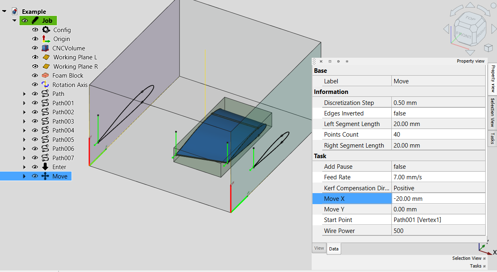
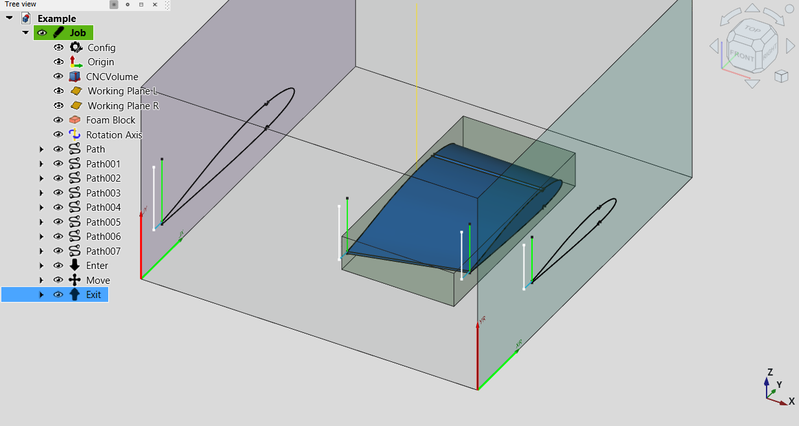
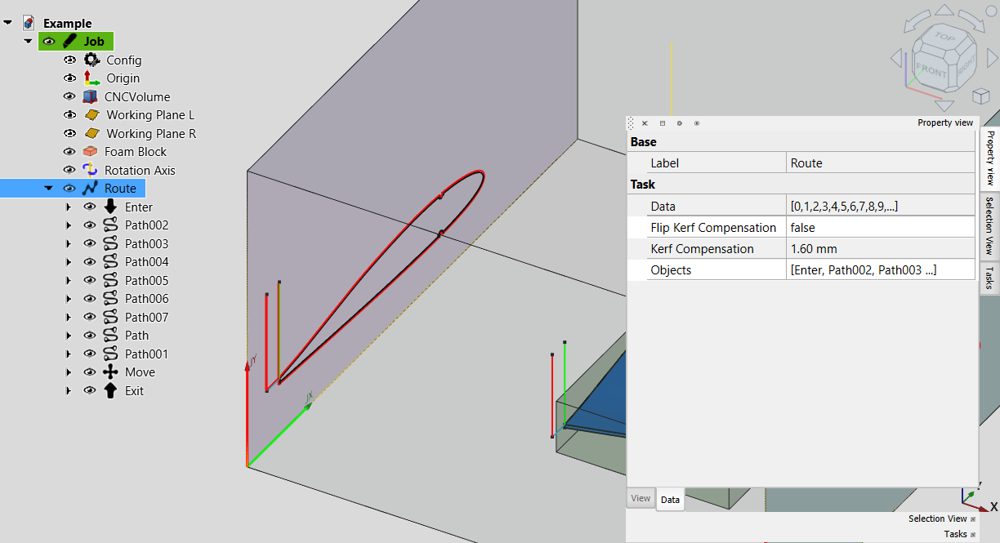

# FoamCut Workbench

A FreeCAD External Workbench for creating Gcode for 4 and 5 axis CNC foam cutting machine.

Originally it based on set of macros written by Andrei Bezborodov (HardRock) - member of FreeCad community. His idea was build 5 axis foam cutter and use FreeCad as a platform to produce output for this machine. Since he has no time to continue development further I decided to step in. Hopefully our effort will be appreciated. 

So far there are many limitation but I'm working on fixes.
If you want to contribute to this project - you highly welcome!
Enjoy!

## Installation

### Automatic Installation

Not available for now

### Manual Installation

Linux:
```bash
cd ~/FreeCAD/Mod/ 
git clone https://github.com/Shkolik/Foamcut.git
```

Windows:
```bash
cd %APPDATA%\FreeCAD\Mod 
git clone https://github.com/Shkolik/Foamcut.git
```

When you restart FreeCAD, "FoamCut" workbench should now show up in the [workbench dropdown list](https://freecadweb.org/wiki/Std_Workbench).
  
## Video Tutorial

For now only old tutorial available (using macro), but workflow is the same (in Russian).
[ЧПУ пенорезка на 5 осей. Подготовка задания в FreeCAD.](https://youtu.be/TuBmqCTIS20?si=CNeAytixMs9086Nn) 
  
## Tools
###  Init Machine
Creates machine configuration 


###  Create path
Creates path by 2 given opposite edges 


###  Create move path
Creates path from selected vertex



###  Join
Creates path between 2 selected vertexes


###  Enter
Creates enter path from safe height to selected vertex


###  Exit
Creates exit path to the safe height from selected vertex



###  Rotation
Rotate selected body around 5th axis


###  Route
Creates a cutting route from selected paths and rotations



###  Generate Gcode
Generates Gcode and save it to the specified file

## Limitations/TODO

 - Machine setup is not parametric. Path and other objects will not be recalculated if you change working area in a middle of the process. But object themself parametric and will be recalculated in case target body parameters got changed.
 - There should be only one machine per file. So far objects strongly depends on that.
 - Need to add foam block representation in setup.
 - 5th axis location not configurable for now
 - Machine origin is hardcoded and locates in a working area center
 - No kerf settings. User can overcome it by modifying model (create Draft offset and use it as reference for paths )
 - It's highly recommended to export your model as .STEP file, import it in new document and start from there. Since all objects depends on underlying geometry you, in most cases, cannot transform your model or part of it to place inside working area. It's higher priority TODO.
 - Cannot create path by selecting faces. In many cases it could be very useful to just select 2 faces and create path/route based on their edges (somewhat like loft) instead of selecting edges one by one.
 - many more I forgot for sure ;) 

## Discussion
Please offer feedback or connect with the developer via the [dedicated FreeCAD forum thread].
Will be added soon

## License
GNU Lesser General Public License v2.1